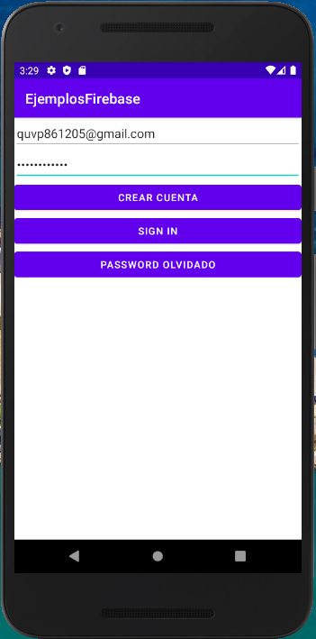
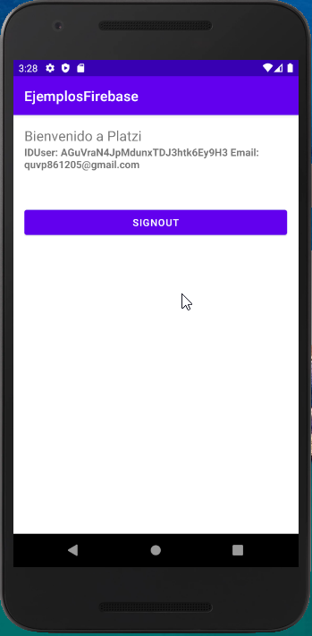

Instalar Android Studio: https://developer.android.com/studio

Crear cuenta y proyecto en firebase: https://firebase.google.com/
 - se va ocupar el nombre del proyecto en AndroidManifest.xml: com.pquinonezv.ejemplosfirebase
 - Obtener el SHA-1: En android studio / gradle / tasks / android / signinReport
 - Descargar el google-services.json y ponerlo en la carpeta app
 - Agregar las referencias necesrias en los archivos build.gradle
 
**Login con correo y contraseña**

